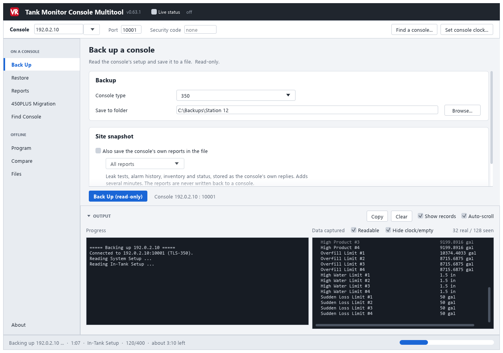
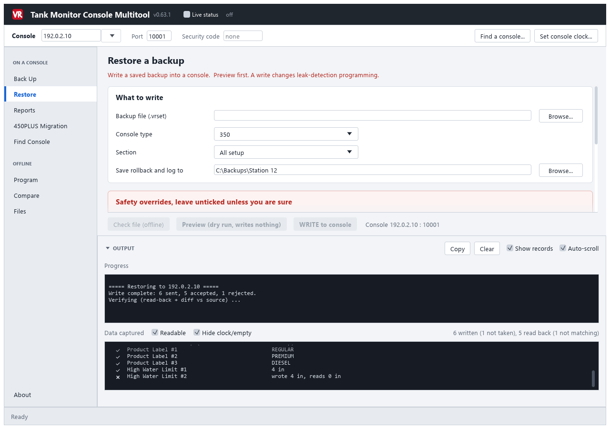
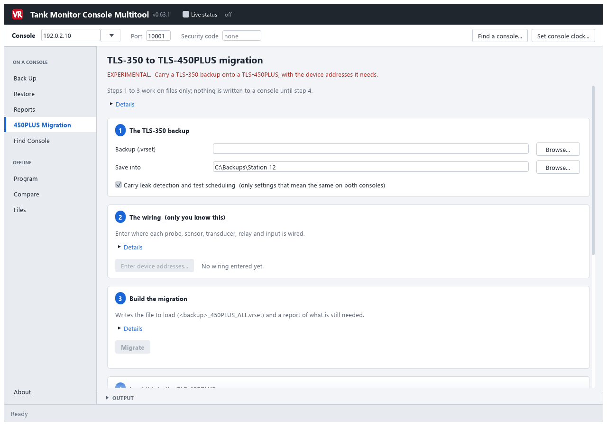

# Tank Monitor Console Multitool

Back up, compare, restore and program TLS-350 tank monitor consoles over their TCP/IP card or a
serial-to-TCP bridge. Pull the console's reports for a compliance file, and move a TLS-350's
programming onto a TLS-450PLUS.

**[Download the latest version](../../releases/latest)** and run it. One `.exe`, nothing to
install.

**Back up**

**Restore, with every setting read back and checked**

**TLS-350 to TLS-450PLUS migration**

## Features

- **Back up** a console's setup to a restorable `.vrset` file, a readable report, or both. Read-only.
  A backup records which areas it covered and any setting the console did not answer.
- **Compare** two backups offline.
- **Reports:** leak tests, CSLD, line leak, sensor and pump status, alarm history, inventory and
  deliveries. Over eighty reports, saved exactly as the console prints them.
- **Restore** a backup to a console. Preview first, nothing written until you confirm, a rollback
  backup taken first, and every value read back afterwards. Restore everything or one area.
- **Check a backup offline** before going to site: what would be written, refused or missing.
- **Roll back** a restore from the rollback file it took.
- **Resume** a restore that was cut off part way.
- **Program** a TLS-350 or TLS-450PLUS setup offline, with the manual's help for every field.
- **Files:** every backup on the laptop, what it is, and which ones must not be restored.
- **Stamped files:** a file that needs a newer version, or was altered, is refused.
- **Find a console** on the network, including one on a different subnet.
- **Migrate a TLS-350 to a TLS-450PLUS** in five steps, with the device addresses, pumps, lines and
  line-disable events built from what you enter, and a report of what is left to do.
- **Live status:** the console's alarm state at the top of the window.
- **Progress** with time remaining for backups, restores and reports.

## Requirements

Windows, and a network route to the console (its TCP/IP card, usually port 10001, or a
serial-to-TCP bridge).

- **TLS-350:** fully supported.
- **TLS-450PLUS:** backup, migration, programming and restore, all experimental. Check every value
  it writes.
- **TLS-450** (without PLUS): not supported.

## Updates

The tool tells you when a newer version is out, and can install it for you when you say yes. It
will not install while it is connected to a console. **Check for updates** is on the About tab.

Updating from 0.59.1 or earlier installs the new version in place. Settings and backups carry
over. The portable `.zip` is no longer published.

## First run

Windows shows "Windows protected your PC" the first time you run a new version. Click
**More info**, then **Run anyway**. The program is signed by **Verbose Software** with a
self-issued certificate. Download it only from the [releases page](../../releases).

If antivirus quarantines it, report the file to Microsoft as a false positive, or ask your IT
department to allow it.

## Status

Beta, under active development, and may contain bugs.

**This tool programs live leak-detection equipment.** It is intended for trained service
technicians working on consoles they are authorised to service.

- The developer is not responsible for missing, incorrect or lost configuration, equipment
  downtime, compliance consequences, or any other result of using this tool.
- Back up before writing, keep the rollback file a restore creates, and verify the console's
  programming afterwards.
- **Print the console's setup before and after, and compare the two printouts.**
- A backup can be incomplete. The tool records what is missing and says so when you restore it.
- A TLS-450PLUS backup does not replace the console's own DB Backup.
- A certified technician must verify leak-detection operation after any write.

Use at your own risk.

## Security

See [SECURITY.md](SECURITY.md). Each release lists the SHA-256 of its `.exe`.

## Legal

An independent tool, developed and published by Verbose Software. **Not developed, approved,
endorsed, or supported by Gilbarco Veeder-Root, its parent, or any of its affiliated companies.**

TLS-350 is a trademark of Gilbarco Veeder-Root. Other product names and trademarks belong to their
owners and are used only to describe what the tool works with.

## Licence

Free to download and use, including at work. Not open source: it may not be sold or passed off as
someone else's work. See [LICENSE](LICENSE), and [THIRD-PARTY-NOTICES.md](THIRD-PARTY-NOTICES.md)
for the open-source components it includes.

Copyright (c) 2026 Verbose Software. All rights reserved.
